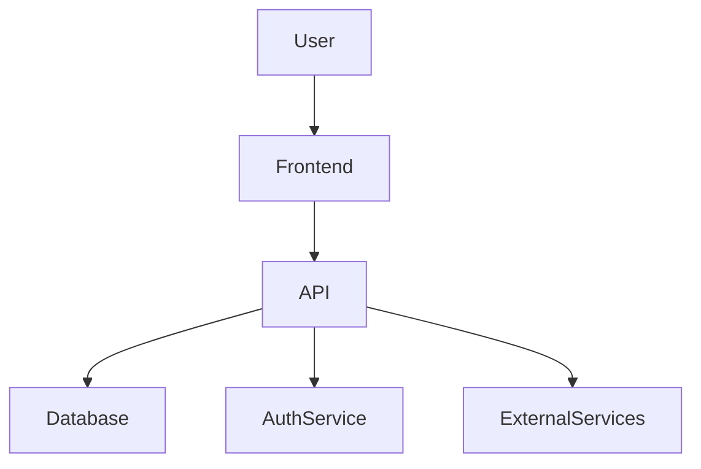

# 🏗️ Architecture Overview

This document provides an overview of the system architecture for **[Project Name]**, including its components, data flow, and dependencies.

---

## 📌 **1. High-Level Overview**
**[Project Name]** is a [e.g., web application, microservice, monolithic system] designed to [brief project goal]. It follows a [e.g., client-server, microservices, event-driven] architecture.

### **Key Features**
- 🏗 Modular design for easy scalability
- 🔌 API-driven communication
- ⚡ Optimized for high performance
- 🔐 Secure authentication & data protection

### **Technology Stack**
| Component      | Technology |
|---------------|------------|
| Frontend      | React / Vue.js / Angular |
| Backend       | Node.js / Python / Java |
| Database      | PostgreSQL / MySQL / MongoDB |
| API Protocol  | REST / GraphQL / gRPC |
| Authentication | OAuth 2.0 / JWT / Firebase |
| CI/CD         | GitHub Actions / Jenkins / Docker |

---

## 📜 **2. System Architecture Diagram**
Below is a high-level diagram showing how the system components interact:

📷 *(Insert system diagram here, e.g., generated with Excalidraw, Mermaid, or draw.io)*

---

## 🏛 3. Components & Responsibilities
### 3.1 Frontend
- Provides user interface for interacting with the system.
- Communicates with the backend via API requests.
- Uses state management (e.g., Redux, Vuex) for client-side logic.
### 3.2 Backend
- Handles business logic and processes requests from the frontend.
- Implements authentication and security policies.
- Manages database transactions and external API calls.
### 3.3 Database
- Stores persistent data such as user information, logs, and transactions.
- Optimized for **scalability and performance** with indexing and caching.
### 3.4 API Gateway (If applicable)
- Manages API traffic, load balancing, and request authentication.
- Provides a unified interface for microservices.
### 3.5 Authentication Service
- Manages user authentication and authorization.
- Supports OAuth 2.0, JWT, or API key-based authentication.
### 3.6 CI/CD Pipeline
- Automates testing, building, and deployment.
- Uses **Docker, GitHub Actions, Jenkins, or Travis CI** for continuous integration.

--- 

## 🔄 4. Data Flow
**Example: User Registration Process**  
1️⃣ User submits registration form on the frontend.  
2️⃣ Request is sent to the API (`POST /api/register`).  
3️⃣ API validates data and hashes password.  
4️⃣ Data is stored in the database.  
5️⃣ API responds with success or error message.  
6️⃣ User receives confirmation email.

--- 

## 🔧 5. Scalability & Performance Considerations
- **Database Optimization**: Indexing, caching, and query optimization.
- **API Rate Limiting**: Prevents abuse with throttling strategies.
- **Load Balancing**: Distributes traffic across multiple backend instances.
- **Containerization**: Uses Docker for microservice scalability.

--- 

## 🔐 6. Security Best Practices
- **Data Encryption**: All sensitive data is encrypted at rest and in transit.
- **Rate Limiting**: Prevents DDoS attacks with throttling mechanisms.
- **Input Validation**: Protects against SQL Injection & XSS attacks.

--- 

## 📈 7. Future Improvements
🛠 Planned architectural improvements:
- Migrate to **GraphQL** for flexible API responses.
- Implement **Redis** caching for faster query performance.
- Adopt **Kubernetes** for better scalability.

--- 

## 📞 8. Questions & Contributions
If you have questions or suggestions about the architecture:

- Open a **GitHub Issue**: [Issues](https://github.com/kdsn/project-template/issues).
- Contact support: <support@example.com>

---

🚀 Built with ❤️ by [Your Team / Organization]!